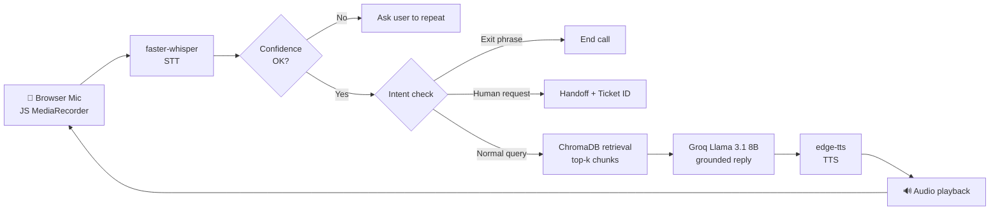

# 🎙️ Customer Support Voice Bot

An end-to-end **voice-based customer support assistant** that listens through your browser microphone, retrieves answers from a company knowledge base (RAG), generates a short spoken-style reply with an LLM, and talks back — including a **human-escalation flow**.

[](https://colab.research.google.com/github/gayatri-vidhate-3/customer-support-voice-bot/blob/main/notebooks/Customer_Support_Voice_Bot.ipynb)


<!-- Add a demo GIF/video here:  -->

---

## ✨ Features

- 🎤 **Browser mic capture in Colab** via JavaScript `MediaRecorder` (no `sounddevice` needed)
- 📝 **Speech-to-Text** with `faster-whisper` (`small`, int8, VAD filter, greedy decoding for speed)
- 📚 **RAG grounding** with LangChain + ChromaDB + `all-MiniLM-L6-v2` embeddings
- 🧠 **LLM replies** from Groq `llama-3.1-8b-instant` — short, markdown-free, voice-friendly
- 🔊 **Text-to-Speech** with `edge-tts` (`en-US-JennyNeural`), playback-aware so recording never overlaps the bot's voice
- 🧍 **Human escalation state machine**
  - Direct request ("talk to a human agent") → immediate handoff with a ticket ID
  - Bot-offered escalation → waits for yes/no on the next turn
- 🛡️ **Low-confidence guard** — rejects garbled transcriptions using Whisper's `avg_logprob` before they reach the LLM
- 💬 **Multi-turn memory** via chat history

---

## 🏗️ Architecture



---

## 📁 Project Structure

```
customer-support-voice-bot/
├── notebooks/
│   └── Customer_Support_Voice_Bot.ipynb   # Full pipeline (run in Colab)
├── data/
│   └── support_docs.txt                   # Knowledge base for RAG
├── docs/                                  # Demo GIF, screenshots, sample conversations
├── requirements.txt
├── .gitignore
├── LICENSE
└── README.md
```

---

## 🚀 Quick Start (Google Colab)

1. Click the **Open in Colab** badge above.
2. Get a free API key from [console.groq.com/keys](https://console.groq.com/keys).
3. In Colab, open the 🔑 **Secrets** panel, add a secret named `GROQ`, paste your key, and enable **Notebook access**.
4. Run the cells in order. When prompted in Step 4, upload `data/support_docs.txt`.
5. In the final cell, run `run_voice_bot(turn_duration=5, max_turns=6)` and **allow microphone access** in your browser.

> ⚠️ Never hard-code your API key in the notebook or commit it to Git.

---

## 🗣️ Try These Questions

| Say this | Topic retrieved |
|---|---|
| "What is your refund policy?" | Refund Policy |
| "How do I return an item?" | Return Process |
| "How can I track my order?" | Order Tracking |
| "My order is delayed, what should I do?" | Shipping Delays |
| "Can I cancel my order?" | Cancelling an Order |
| "My payment failed, what happens now?" | Payment Issues |
| "I can't log in to my account" | Account and Login Help |
| "Does this come with a warranty?" | Warranty Information |
| "Can I speak to a human agent?" | Escalation flow |

Say **"bye"** or **"that's all"** to end the call.

---

## ⚙️ How It Works

| Stage | Tool | Key settings |
|---|---|---|
| Record | JS `MediaRecorder` | 4–5 s window, WebM |
| STT | `faster-whisper` | `small`, `int8`, `beam_size=1`, `vad_filter=True` |
| Chunking | `RecursiveCharacterTextSplitter` | 500 chars, 50 overlap |
| Embeddings | `all-MiniLM-L6-v2` | Cosine similarity in Chroma |
| Retrieval | ChromaDB | top-`k=2` |
| LLM | Groq `llama-3.1-8b-instant` | `temperature=0.3`, `max_tokens=120` |
| TTS | `edge-tts` | `en-US-JennyNeural` |

**Prompt design:** replies are capped at 2–3 sentences, with no bullets or markdown, and answer *only* from retrieved context; otherwise the bot offers a human agent.

---

## 🔧 Customising the Knowledge Base

Replace `data/support_docs.txt` with your own content — plain text, one topic per section (heading line followed by a paragraph), separated by blank lines.

---

## 🛠️ Challenges Solved (Colab-specific)

- `asyncio` event-loop conflict with `edge-tts` → `nest_asyncio`
- Bot audio overlapping next recording → wait for measured mp3 duration (`pydub`) before recording
- Whisper accuracy on short clips → `small` model + VAD + confidence threshold
- Escalation logic → separate handling for direct requests vs. bot-offered handoff

---

## ⚠️ Known Limitations

- Fixed-length recording window (no live end-of-speech detection)
- Runs in Colab only (relies on browser JS mic capture)
- English only; keyword-based intent matching for exit/escalation
- Handoff is simulated (generates a mock ticket ID, no real ticketing integration)

## 🗺️ Roadmap

- [ ] Voice activity detection for automatic end-of-turn
- [ ] Replace keyword intent matching with LLM/classifier-based intent detection
- [ ] Streaming STT/LLM/TTS to cut latency
- [ ] Gradio/Streamlit web UI for local deployment
- [ ] Retrieval evaluation (hit-rate / MRR) and latency benchmarks
- [ ] Multilingual support

---

## 🧰 Tech Stack

Python · faster-whisper · LangChain · ChromaDB · Sentence-Transformers · Groq (Llama 3.1) · edge-tts · pydub · Google Colab


## 👩‍💻 Author

**Gayatri Vidhate** — Data Scientist | Machine Learning Engineer | NLP Engineer | GenAI Engineer

[GitHub](https://github.com/gayatri-vidhate-3) · gayatri.vidhate.gv@gmail.com

If you found this useful, feel free to ⭐ the repo or connect with me!
